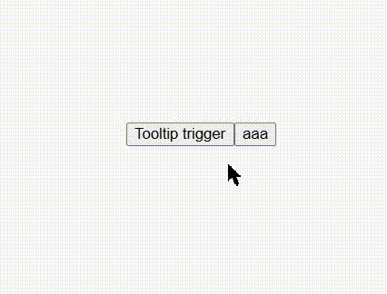

> [!warn]
> この記事は他サイトから移行したものです。

> [!note]
> この記事は [React Aria の実装読むぞ - Qiita Advent Calendar 2024](https://qiita.com/advent-calendar/2024/react-aria) の 7 日目の記事です。

こんにちは、フロントエンドエンジニアの mehm8128 です。
今日は Tooltip について書いていきます。

https://react-spectrum.adobe.com/react-aria/useTooltipTrigger.html

## `useTooltip` とは

ツールチップを作るための hook です。

## 使用例

ドキュメントからそのまま取ってきています。

```tsx
function Tooltip({ state, ...props }) {
  let { tooltipProps } = useTooltip(props, state);

  return (
    <span
      style={{
        position: "absolute",
        left: "5px",
        top: "100%",
        maxWidth: 150,
        marginTop: "10px",
        backgroundColor: "white",
        color: "black",
        padding: "5px",
        border: "1px solid gray",
      }}
      {...mergeProps(props, tooltipProps)}
    >
      {props.children}
    </span>
  );
}

function TooltipButton(props) {
  let state = useTooltipTriggerState(props);
  let ref = React.useRef(null);

  // Get props for the trigger and its tooltip
  let { triggerProps, tooltipProps } = useTooltipTrigger(props, state, ref);

  return (
    <span style={{ position: "relative" }}>
      <button
        ref={ref}
        {...triggerProps}
        style={{ fontSize: 18 }}
        onClick={() => alert("Pressed button")}
      >
        {props.children}
      </button>
      {state.isOpen && (
        <Tooltip state={state} {...tooltipProps}>
          {props.tooltip}
        </Tooltip>
      )}
    </span>
  );
}
```

## 本題

WAI-ARIA はこちらです。
https://www.w3.org/TR/wai-aria-1.2/#tooltip

### スクリーンリーダー読み上げ

WAI-ARIA を読んでみると、tooltip が表示されるタイミングで`aria-describedby`によって tooltip が参照されるべきと書いてあります。

React Aria では`isOpen`のときに`triggerProps`の`aria-describedby`に`tooltipId`を渡しています。これによって、trigger ボタンの accessible description に tooltip の中身が入り、キーボードでフォーカスして tooltip が表示されたときに、ちゃんと tooltip の中身が読み上げられます。

https://github.com/adobe/react-spectrum/blob/5ed06068ee2742f32e066ffa8eb55fd93a083123/packages/%40react-aria/tooltip/src/useTooltipTrigger.ts#L140

例えば Example の 1 つ目の ✏️ ボタンだと

```
クリック可能 ✏️ ボタン Edit
```

というように読み上げられます。最後の「Edit」が tooltip の中身です。

### Chrome のバグ

Chrome において、以下の 2 つのパターンでツールチップが閉じてほしいという issue を解消するために PR が出されました。

- ツールチップが開いているときにツールチップの外側をクリックしたとき
- キーボードフォーカスでツールチップを開いた状態で、さらにマウスでホバーしてホバーを解除したとき

https://github.com/adobe/react-spectrum/pull/1087

そして、このタイミングで Chrome のバグへの対応もされました。

https://github.com/adobe/react-spectrum/blob/b0f15697245de74ebc99ab3d687f5eb3733d3a34/packages/%40react-aria/tooltip/src/useTooltipTrigger.ts#L83-L91

ツールチップのトリガーにホバーしてツールチップを表示しているときに、それ以外の要素がツールチップのトリガーを隠してしまい、マウスカーソルがその要素に当たってしまうという状況を考えています。この場合に、一旦ツールチップが消えるのですが、ツールチップを隠していた要素が消えると再度ツールチップが表示されてしまうというバグです。分かりづらいので動画をご覧ください。

こちらがバグが解消されている、現在の状態です。赤い四角が消えてもツールチップは再度表示されません。マウスによるクリックはしていなくて、`aaa`ボタンにキーボードでフォーカス＆Enter キーを押して赤い要素の表示・非表示を制御しています。


こちらがバグが発生している状態です。赤い四角が消えると、再度ツールチップが表示されてしまいます。


また、React Aria Components の Storybook で `TooltipExample` の story を以下のようなコードに置き換えることで再現可能です。
バグが発生している状態を再現するには、上で引用したソースコードで条件分岐せずに常に`isHovered.current = true`するように変更してください（分からなければ PR の差分を見てください）。

```tsx
export const TooltipExample = () => {
  const [isShown, setIsShown] = useState(false);

  return (
    <div style={{ position: "relative" }}>
      <TooltipTrigger>
        <Button>Tooltip trigger</Button>
        <Tooltip
          offset={5}
          style={{
            background: "Canvas",
            color: "CanvasText",
            border: "1px solid gray",
            padding: 5,
            borderRadius: 4,
          }}
        >
          <OverlayArrow style={{ transform: "translateX(-50%)" }}>
            <svg width="8" height="8" style={{ display: "block" }}>
              <path
                d="M0 0L4 4L8 0"
                fill="white"
                strokeWidth={1}
                stroke="gray"
              />
            </svg>
          </OverlayArrow>
          I am a tooltip
        </Tooltip>
      </TooltipTrigger>
      {isShown && (
        <div
          style={{
            backgroundColor: "red",
            height: 100,
            width: 100,
            left: 0,
            top: 0,
            position: "absolute",
          }}
        />
      )}
      <button onClick={() => setIsShown(!isShown)}>aaa</button>
    </div>
  );
};
```

これを解消するために、`onHoverStart`内で`getInteractionModality`という関数を用いて、何によってインタラクションが行われたのかを確認しています。マウスの移動によってホバーされた場合は`getInteractionModality() === 'pointer'`ですが、赤い四角が消えて再度ホバー状態になった場合には`getInteractionModality() === 'virtual'`になっているので、上で引用した if 文の`else`の方が実行されます。

### tooltip 自体へのホバー

トリガーとなるボタンからホバーが外れたとしても、tooltip 自体をホバーしていれば消えないようになっています。
[Web アプリケーションアクセシビリティ本](https://amzn.asia/d/erlHCpO)では、「画面拡大時に tooltip が画面外にはみ出てしまったときでも、tooltip をホバーしながら画面移動することで tooltip を表示したまま内容を全て読めるようにするため」にこの機能が必要だと書かれています。
また、tooltip とトリガーとなるボタンとの間に隙間があるときにカーソルを移動させると tooltip が消えてしまわないように、tooltip が消えるまで数秒の遅延を挟んでいます。

## まとめ

明日の担当は [@mehm8128](https://x.com/mehm8128) さんで、 Popover と Dialog についての記事です。お楽しみにー
