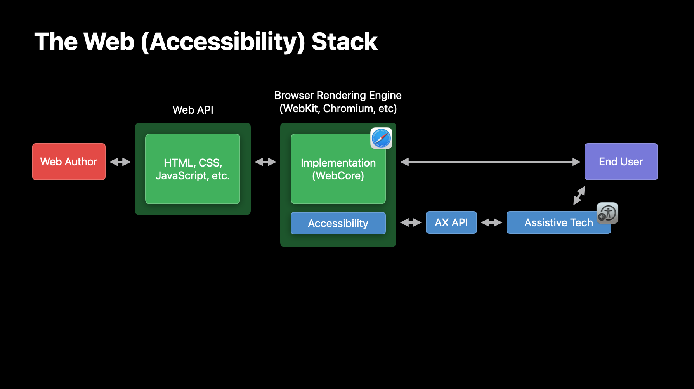
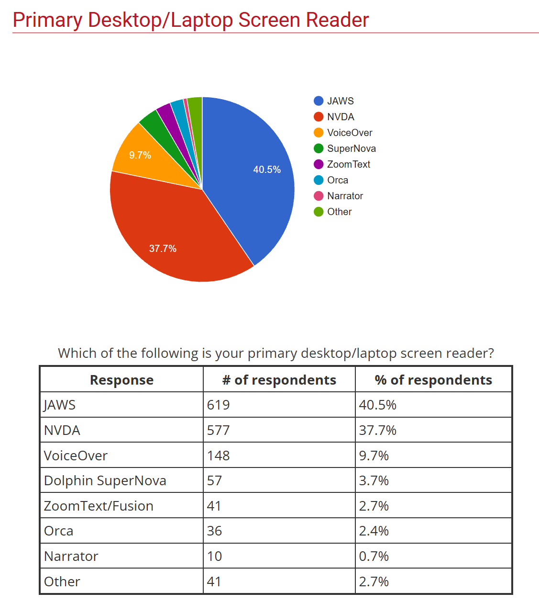
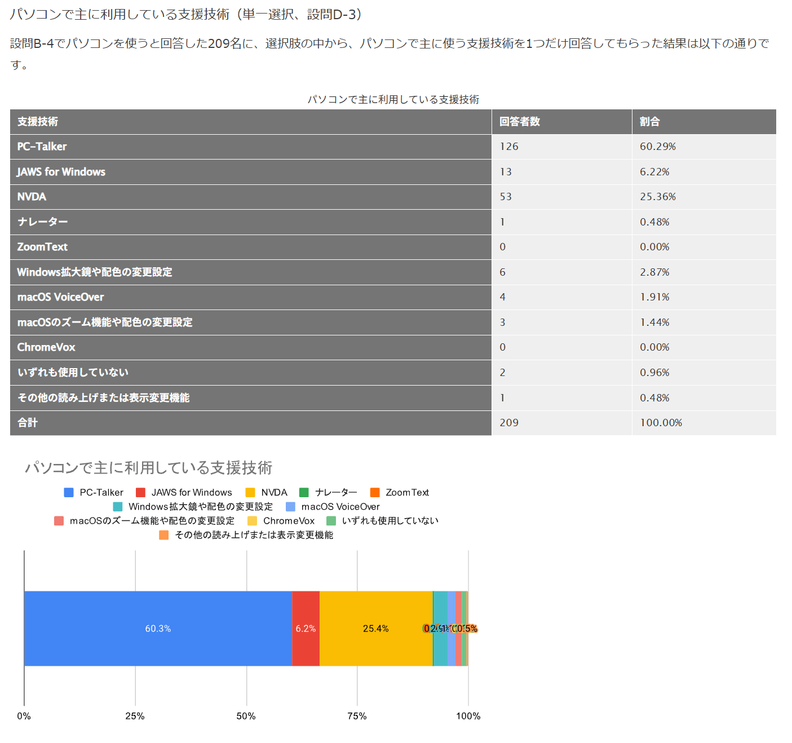

こんにちは、mehm8128です。

本シリーズでは、この1年間アクセシビリティの中でも特に意識してコントリビュート・情報収集してきた「Accessibility Supported」の分野（以後「AS」と略）で8日間書いていきます。

## Accessibility Supported (AS) とは

Accessibility Supported (AS) とは、あるWeb技術が、ユーザーエージェント（UA）・支援技術（AT）の組み合わせでサポートされていることを表す言葉です。
これはWCAGの[適合を理解する | WAI | W3C](https://waic.jp/translations/WCAG22/Understanding/conformance#accessibility-support)のページで導入されています。

HTMLがユーザーエージェントによってパースされ、Accessibility APIを通じて支援技術に届く、という構造になっているため、開発者が書いたHTMLはユーザーエージェントと支援技術の両方によって正しく解釈され、ユーザーに伝わる必要があります。また、ユーザーエージェントは一般にブラウザを指しますが、必ずしもブラウザに限らないことから「ユーザーエージェント」という表記になっています。支援技術についても、スクリーンリーダーを前提に議論されることが多いですが必ずしもそれだけとは限らず、点字ディスプレイなどその他の支援技術を含みます。

ソース: https://github.com/w3c/aria/blob/main/documentation/tests.md

Web技術があるユーザーエージェントや支援技術でサポートされていないことが発見されたとき、ベンダー側にフィードバックしたり修正しようとしたりされることなく、workaroundで対処する方法だけが広まってしまい、それを色々な人が使ってしまいがちです。しかし、本当に正しく対処するのであれば、その問題が発生しているユーザーエージェントや支援技術のベンダーにフィードバックしたり、修正がリリースされてそれが十分多くの人に行き届いた（Widely Availableになった）タイミングで正規の方法に切り替えるといった対応をしたりする必要があります。また、不具合のように見えて誤った対処方法が広まってしまっている挙動でも、実はベンダーの意図通りの挙動をしているというケースもあります。

本来は「正しいHTML」を書いたらそれをあらゆるユーザーが理解できるようになっているべきです。しかし、現実としてはユーザーエージェントや支援技術のサポート不足によってユーザーに伝わらないという状況が起こり得ます。その際に、hackyなHTMLを書いてユーザーに届くようにするのではなく、サポート不足自体を解消するのが健全です。

より多くのWeb技術がASになるとアクセシビリティは当然向上しますが、「このユーザーエージェント・支援技術では動かない」というケースに出会う頻度が減ることで、開発生産性も上がります。誤った対応方法を選択することによる副次的なアクセシビリティの低下も避けることができます。
そういったケースを正しく判断し、対応できるような人が増え、Web技術がよりアクセシブルになればと思います。

## WebAIM Screen Reader User Survey / 支援技術利用状況調査

支援技術の利用状況調査が、国内でも国外でも行われています。ここでは、国内と国外それぞれ1つずつ紹介していき、客観的なデータからASの重要性を見ていきます。

まずは国外の調査である[WebAIM: Screen Reader User Survey #10 Results](https://webaim.org/projects/screenreadersurvey10/)からです。執筆時点では第10回の結果が最新ですが、第11回の結果を集計中という状態になっています。
この調査は、支援技術の中でもスクリーンリーダーに焦点を当てた調査結果です。様々な国から広く回答を集めており、障害のないユーザーからの回答も1割ほどあったようです。

今回主に着目してほしいのは以下の項目です。

- Primary Desktop/Laptop Screen Reader
- Screen Readers Commonly Used　
- Browsers
- Screen Reader / Browser Combinations
- Operating System

普段の開発では、WindowsはNVDA、MacはVoiceOverで動作確認をすることが多いと思いますが、実際の利用割合としては、JAWSとNVDAがほぼ同じくらいの利用率でトップ、それに次いでVoiceOverなどが入ってきています。しかも、VoiceOverをPrimaryなスクリーンリーダーとして使っている人は1割ほどです。これは"Operating System"の項目で分かるように、障害のある回答者はそもそもMacよりもWindowsを使う傾向にあるということに由来します。
また、"Browsers"ではChromeが半分を占めているものの、EdgeやFirefox、Safariについては同じくらいの割合となっています。

次に、国内の調査である[第4回支援技術利用状況調査報告書 | 日本視覚障害者ICTネットワーク](https://jbict.net/survey/at-survey-04)からです。執筆時点では第4回が最新ですが、第5回の結果も集計中となっているのでそのうち公開されると思います。
これは普段支援技術を使って生活している方々に、利用状況についてアンケートした調査結果になっています。

調査結果のページが長くてどこから見れば良いか戸惑いますが、今回注目したいのは以下の項目です。

- パソコンで利用しているプラットフォーム
- パソコンで使うことがある支援技術
- パソコンで主に利用している支援技術
- パソコンで利用しているWebブラウザー

こちらの結果でもほとんどのユーザーがWindowsを使っているという結果になっています。
しかし、先ほどの調査結果と大きく異なるのは、「主に利用している支援技術」です。「使うことがある支援技術」ではNVDAやナレーターがPC-Talkerより少し低いくらいの数値に留まっていますが、「主に利用している支援技術」では圧倒的にPC-Talkerが多くなっています。PC-Talkerは日本独自のスクリーンリーダーであり、先ほどの国外の調査結果では現れていなかったものです。
同様に、「利用しているWebブラウザー」はEdgeやChromeと並んで[NetReader](https://www.aok-net.com/products/netreaderneo.php)が一定の割合を占めています。これはPC-Talkerに付属する音声読み上げブラウザで、PC-Talkerと同じく日本独自のものです。

このように、国内外問わず様々な支援技術やブラウザが使われており、PC-Talkerなど国に特有のものが多く使われているという現状もあります。また、Web開発者はMacユーザーが多いのに対して、実際に障害を持っているユーザーのほとんどはWindowsユーザーであるという環境の乖離もあります。
この結果に基づくと、Web開発者が実際のユーザーと同じような環境で十分にWebサービスの動作確認をできているかというと、なかなかそうはいっていないと考えられます。もちろんサポート対象のブラウザをサービス側で指定していることもありますが、本来はユーザーが使い慣れた環境でサービスを利用できる状態が理想です。

環境間で動作の差異が発生していなければ、複数の環境で動作確認をするという手間はある程度省くことができ、このような開発側とユーザー側の環境が違うという現状も問題にならなくなります。そのために、Web技術がASであるということは必要になります。

## 構成・進め方

前半にASの基本的な説明をし、後半にARIA-ATやWCAG3、ACDなどW3CでのASに関連する動向について紹介していきます。

なお、アクセシビリティの基本的な話や「**A**utonomous **S**ystem」の話は書く予定はありません。

## まとめ

それではまた明日。
