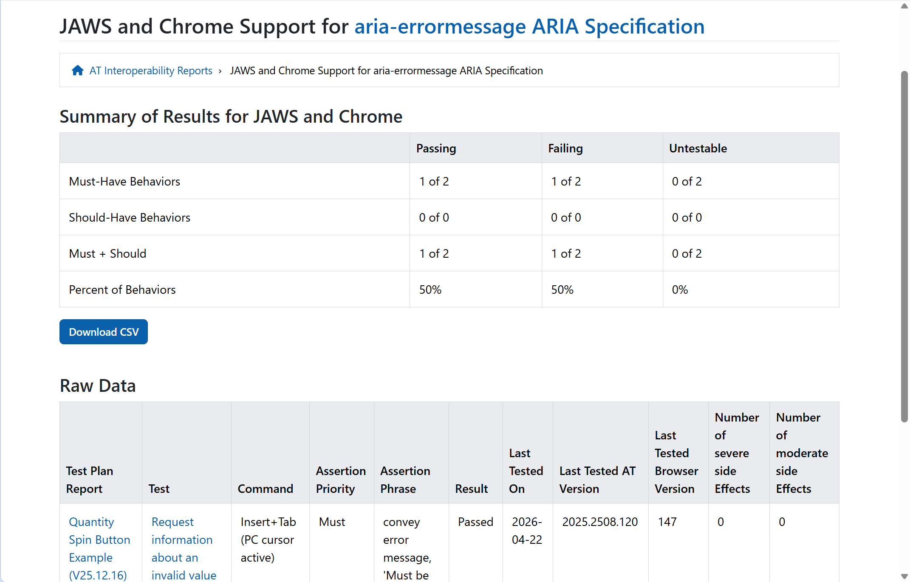

こんにちは、mehm8128です。

今回はAccessibility Compat Data (ACD) Projectを紹介します。

## 既存の問題

普段の開発において、ESLintやBiome、Oxlintなどの静的解析ツールを用いたり、axeのようなブラウザ上で使えるようなアクセシビリティチェックツールを用いたりしています。
「このHTML要素にはこのロールはつけてはいけない」「img要素にはalt属性をつけましょう」「onClickつけるならbutton要素を使いましょう」などなど、様々なルールが含まれています。

しかし、これまで見てきたように、linterでエラーになっていないからといって、必ずしも問題ないわけではありません。`aria-sort`を許可されたHTML要素で許可された値で使っているからといって、どの環境でも意図通りにユーザーに伝わるとは限りません。特定の状況下では、img要素のalt属性がユーザーに伝わらないケースもあるかもしれません。
そのようなケースは、linterでは現状判断できません。

そこで、2日目に紹介したようなASに関するデータベースを改めて構築し、MDNなど既存のリソース・開発者ツールに組み込むことを目指すプロジェクトが進んでいます。それが、ACD Projectです。

## Accessibility Compat Data (ACD) Project

ACD Projectは、既存の[Browser Compat Data](https://github.com/mdn/browser-compat-data)のアクセシビリティバージョンのようなものです。

https://github.com/lolaslab/accessibility-compat-data

Browser Compat Dataは、Web技術のブラウザごとの相互運用性データとなっており、MDNのBaseline表示などに用いられています。しかしこれはブラウザからAccessibility APIを通じて情報が適切に公開されているかどうかや、適切に公開されていてもそれを支援技術が一貫性を持ってユーザーに伝えているかどうかというのは考慮されていません。

1日目にも出てきた以下の図の右下にある、ブラウザエンジンからAccessibility API、支援技術、ユーザーに繋がる矢印の部分の情報がないということになります。

ソース: https://github.com/w3c/aria/blob/main/documentation/tests.md

そこでACD Projectでは、WPTで取得しているブラウザごとのアクセシビリティ関連の相互運用性データや、ARIA-ATで取得された、支援技術からユーザーに伝わる情報のデータを収集し、MDNなどに組み込もうという試みが行われています。

このデータが利用可能になれば、これを用いてlinterのルールを作成することで、プロダクトがサポートしたい環境において、ある技術がASであるかどうかが分かります。

資金援助が必要とのことで、僕は少ないながらこのプロジェクトに毎月支援をしています。

https://opencollective.com/lolas-lab/projects/acd

## ARIA-ATとの関係

2日目の記事では、ARIA-ATは基本的にAPGのパターンをテストケース化していると書いたのですが、実はそれだけではありません。最近はもっと小さいatomicな単位でテストケースを作成されています。

[AT Interop Reports | ARIA-AT](https://aria-at.w3.org/reports)でARIA FeaturesやHTML Featuresのタブを開くと、ARIA属性やHTML要素といった単位でテストケースを確認できます。

ソース: [JAWS and Chrome Support for aria-errormessage ARIA Specification | ARIA-AT Reports](https://aria-at.w3.org/aria-html-feature/1/2/aria-errormessage/aria)

ACD Projectのオーナーであるlolaも最近、ARIA-ATに対してPRを作成し、自らテストケースを増やす動きをしています。
[HTML-AAM/Button by lolaodelola · Pull Request #1400 · w3c-cg/aria-at](https://github.com/w3c-cg/aria-at/pull/1400)

それを基にして、テストケースを作成する方法に関するドキュメントを改善し、より多くの人がテストケース作成に携われるようにしていく方針のようです。
この議論の様子は以下のminutesから確認できます。

- [ARIA and Assistive Technologies Community Group – 29 July 2026](https://www.w3.org/2026/07/29-aria-at-minutes.html)
- [ARIA and Assistive Technologies Community Group – 12 August 2026](https://www.w3.org/2026/08/12-aria-at-minutes.html)
- [ARIA and Assistive Technologies Community Group – 26 August 2026](https://www.w3.org/2026/08/26-aria-at-minutes.html)

ミーティングで話されていたようなTPACでのハッカソンや同期的なやり取りはハードルが高いですが、ドキュメントが整備されてテストケースを新規参入者が追加しやすくなっていそうなタイミングで、僕も貢献してみたいなと考えています。

## 本当にこれでいけるのか？

WCAGのテクニックであれば、ある環境においてあるテクニックがASかどうかは比較的容易に判断できます。しかし実際のプロダクトにおいては、WCAGのテクニックだけが全てではありません。あるWeb技術に対してどこまでの挙動を保証したいかというのはプロダクトにおいて違います。
例えばimg要素の`alt`属性1つとっても、以下のような挙動を想定できます。

- 値が画像のaccessible nameとしてユーザーに伝わる
- ページ翻訳をしたときに翻訳される
- ページ内検索でヒットする
- 画像の要素をコピーしたときに、一緒にコピーされる

似たような話で、SVGのtitle要素についても[インラインSVGの代替テキストはどうするべきか – TAKLOG](https://www.tak-dcxi.com/article/how-to-handle-alt-text-for-inline-svg/)で言及がありました。

これらの挙動が全部保証されていないと使えないのか、それとも最低限accessible nameとしてユーザーに伝わればいいのかが状況によって違う中で、自動テストのテストケースをどこまで用意するかは難しいところです。
ひとまずHTML-AAMとARIA-ATからデータを収集するということだったので、そこの既存のルールに従うことになりそうですが、今後議論の余地がありそうな部分だと、個人的には思っています。

と思っていたところ、ちょうど似たような話をlolaが進めていることが分かりました。

https://bsky.app/profile/lolaodelola.bsky.social/post/3mwbb33oybk2n

https://github.com/w3c/aria/issues/2916

テストケースを作成する段階の話というよりは、既にあるWPTやARIA-ATの結果をどう組み合わせて、どの程度テストを通過していたら「ASである」と定義できるのかという話題を提示しています。
これはTPACのARIA WGやbreakoutsで議論される予定のようです。

## まとめ

それではまた明日。
