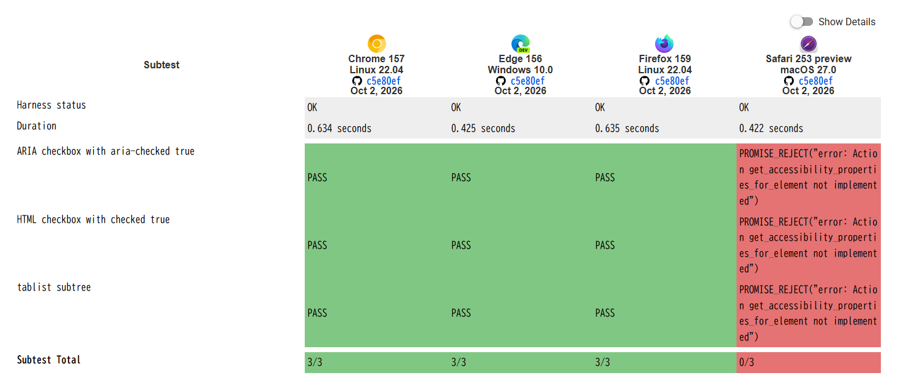

こんにちは、mehm8128です。

今回はAccessibility Testing for WPT Interopについて、大きく2つのプロジェクトを紹介していきます。

## Accessibility Testing for WPT Interopとは

web-platform-tests/interop-accessibilityのリポジトリで行われている、WPTにおけるアクセシビリティの相互運用性のテストに関する取り組みのことです。

https://github.com/web-platform-tests/interop-accessibility

Accessibility Testingは、Interopの"Active Investigations"として採用されており、例えば2026年だと[Interop 2026 Dashboard](https://wpt.fyi/interop-2026)の右下に記載されています。
活動内容は上記リポジトリのissueで管理されており、2026年だと以下のissueにまとめられています。

https://github.com/web-platform-tests/interop-accessibility/issues/202

"Ongoing Scoring Criteria"として全体に占めるそれぞれの活動の割合がまとめられているので、比重の大きいものを見るのが分かりやすいです。

今回はこの中でも45%を占める"GetAccessibilityProperties"と、40%を占める"Acacia AAM test exploration"を順番に見ていきます。

全体像については[Accessibility Interop Project Overview and Contribution Guidelines · web-platform-tests/interop-accessibility Wiki](https://github.com/web-platform-tests/interop-accessibility/wiki/Accessibility-Interop-Project-Overview-and-Contribution-Guidelines)から確認できます。

## Support for testing additional accessibility properties beyond name and role

WPTにおいて今までアクセシビリティのテストは、主にroleとaccessible name、accessible descriptionという主要なプロパティしか確認できていませんでした。
例えば4日目に紹介した僕が作成したテストケースは、accessible nameをテストするものでした: [Add tests for interactive element labels named by svg title elements · web-platform-tests/wpt](https://github.com/web-platform-tests/wpt/pull/56902)

しかし、相互運用性を保証するためには`aria-expanded`などその他のARIA属性もテストする必要があります。
そこで、そういった様々な属性値を取得してテスト可能にする取り組みが行われてます。

今年の3月に[Support for testing additional accessibility properties beyond name and role. · web-platform-tests/wpt](https://github.com/web-platform-tests/wpt/pull/55784)がマージされてWPT側の実装が完了しました。
このPRで追加された`accessibility_properties_basic.tentative.html`を見てみると、以下のようなテストコードがあります。

```html
<div id="ariaCheckbox" role="checkbox" aria-checked="true"></div>
<input type="checkbox" id="htmlCheckbox" checked>

<div id="tablist" role="tablist" aria-label="tablist">
  <div id="tab1" role="tab" aria-label="tab1"></div>
  <div id="tab2" role="tab" aria-label="tab2"></div>
</div>

<script>

promise_test(async t => {
  const acc = await test_driver.get_accessibility_properties_for_element(document.getElementById("ariaCheckbox"));
  assert_equals(acc.checked, "true");
}, "ARIA checkbox with aria-checked true");

promise_test(async t => {
  const acc = await test_driver.get_accessibility_properties_for_element(document.getElementById("htmlCheckbox"));
  assert_equals(acc.checked, "true");
}, "HTML checkbox with checked true");

promise_test(async t => {
  const tablist = await test_driver.get_accessibility_properties_for_element(document.getElementById("tablist"));
  assert_equals(tablist.children.length, 2);
  const tab1 = await test_driver.get_accessibility_properties_for_accessibility_node(tablist.children[0]);
  assert_equals(tab1.accessibilityId, tablist.children[0]);
  assert_equals(tab1.parent, tablist.accessibilityId);
  assert_equals(tab1.role, "tab");
  assert_equals(tab1.label, "tab1");
  // ...(省略)
```

このように`get_accessibility_properties_for_element`や`get_accessibility_properties_for_accessibility_node`で要素を取得し、`aria-checked`や`role`、`aria-label`などのassertionができるようになっています。
このテストケースのテスト結果は[wpt.fyiのページ](https://wpt.fyi/results/wai-aria/accessibility_properties_basic.tentative.html?label=experimental&label=master&aligned)から確認できますが、Safariでは今回の`get_accessibility_properties_for_element`が未実装なのでfailしています。



ここから分かるように今回の取り組みは、各ブラウザエンジンでもそれぞれ追加の修正対応が行われて初めて動くようになります。前述のマイルストーンでも、"Implementations"に各ブラウザエンジンの名前が記載されていました。

それ以外にもWebDriverの仕様更新やTree Walker（Accessibility Treeの走査）の標準化に関する調査、core-aam側の更新などまた作業が残っており、全て完了するまでには至っていません。

## Create new test type for accessibility API testing (Acacia)

こちらは、WPTでAccessibility APIをテストできるようにするプロジェクトです。"Acacia"という名前がつけられており、2025年のTPACでも進捗の共有がありました。

https://notes.igalia.com/p/ggryaQuLq#/

前のセクションで紹介したようなテストは、ブラウザがHTMLを解析して「この要素はこういう属性を持つ」ということを**理解しているかどうか**をテストするものでしたが、Acaciaでテストするのは「この要素はこういう属性を持つ」ということを**Accessibility APIとして公開しているかどうか**をテストするものです。
これらはレイヤーが異なっているので、どちらも必要なテストになっています。ちなみに、HTML要素・属性とAccessibility APIのマッピングは[core-aam](https://w3c.github.io/core-aam/)や[html-aam](https://www.w3.org/TR/html-aam-1.0/)で確認できます。

こちらもWPT側の実装自体は[Create new test type `aamtest` for accessibility API testing · web-platform-tests/wpt](https://github.com/web-platform-tests/wpt/pull/57696)にて完了しています。

AAMのテストはPythonで実装されます。`core-aam/aamtests/role/button.py`を見てみると、AT-SPIというAccessibility APIのテストが書かれています。TEST_HTMLで定義された4種類のHTMLに対して同じ`test_atspi`関数が走り、AT-SPIの仕様である`PUSH_BUTTON`というroleが公開されるかどうかというassertionを行っています。

```python
TEST_HTML = {
    "no-attributes": "<div id=test role=button>click me</div>",
    "aria-pressed-undefined": "<div id=test role=button aria-pressed>click me</div>",
    "aria-haspopup-undefined": "<div id=test role=button aria-haspopup>click me</div>",
    "aria-haspopup-false": "<div id=test role=button aria-haspopup=false>click me</div>",
}

@pytest.mark.parametrize("test_html", TEST_HTML.values(), ids=TEST_HTML.keys())
def test_atspi(atspi, session, inline, test_html):
    session.url = inline(test_html)

    # Spec:
    # Role: ROLE_PUSH_BUTTON

    node = atspi.find_node("test", session.url)
    assert atspi.Accessible.get_role(node) == atspi.Role.PUSH_BUTTON
```

同じファイルの下の方にはAXAPIやIA2、UIAなどその他のAccessibility APIのテストコードがあり、PRの時点ではコメントアウトされていましたが、[最新のファイル](https://github.com/web-platform-tests/wpt/blob/cce39f4f40895399efe26e5dfa51ddaaab12d48a/core-aam/aamtests/role/button.py)だとAXAPIとUIAはコメントアウトではなくてテストコードが記載されています（[Add aamtest support for Safari, implement AXAPI tests by twilco · web-platform-tests/wpt](https://github.com/web-platform-tests/wpt/pull/59768)などで実装されたようです）。

Acaciaによって取得できるようになるAAMの相互運用性データは5日目に紹介したACDで収集され、利用可能になる想定です。

## まとめ

どちらのプロジェクトも、完了したらアクセシビリティの相互運用性の基礎となる重要なテストスイートの作成に役立ちます。基盤の構築が完了したら、テストスイートを増やしていく作業が始まることが考えられます。もちろんAIによる高速化もできますが、自分たちも貢献できるチャンスがあるかもしれないので、動向を逐次追っていきたいです。

それではまた明日。
