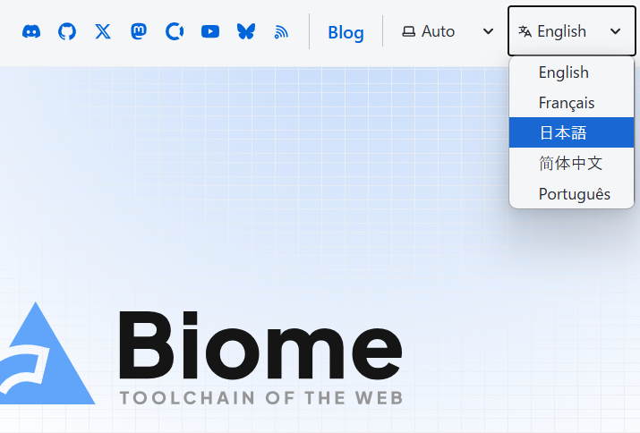
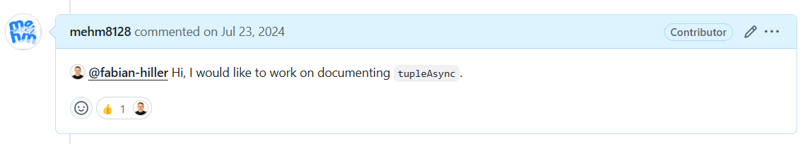

> [!warn]
> この記事は他サイトから移行したものです。

こんにちは、mehm8128 です。今年もよろしくお願いします。
2024 年の振り返りや今年やりたいことは[sizu.me](https://sizu.me/mehm8128)に書きました。
今回は、OSS のドキュメント翻訳に Contribution しようという話を書いていきます。

## OSS のドキュメント翻訳

多くの人に使われている OSS のドキュメントだと、i18n 対応されていることがあります。例えば[Biome のドキュメント](https://biomejs.dev/)だと、右上のセレクトボックスから言語を選択して翻訳されたページを表示できます。

また、[React のドキュメント](https://react.dev/)だと、サイト内で切り替えるのではなくて、サイト丸ごと[日本語バージョン](https://ja.react.dev/)があります。

しかし、英語で書かれたものを日本語に翻訳していることが大半なこともあり、日本語翻訳が追いついていなかったり、少し不自然な日本語になってしまっている、もしくは翻訳自体が間違ってしまっている場合もあります。

そこで、気づいたときには積極的にドキュメント翻訳をするようにしていきたいです。ドキュメントはそのツールを使う上でほぼ必須のものです。英語がスラスラ読める人はいいのですが、そうでない人にとってはハードルが高くなってしまいます（世間一般のエンジニアの英語レベルが分かっていないですが...）。もちろん最近は AI が強力になっているのでページを投げれば丸ごと翻訳してくれることもあると思いますが、毎回 AI に投げるのはめんどくさいし、必ずしもきれいで、ドキュメントの著者の意図を汲んだ翻訳をしてくれるとも限りません。
ドキュメント翻訳は「全ての人がドキュメントの情報にアクセスできる」というアクセシビリティの一種だと考えています。みんなでアクセシブルな世界にしていき、自分の好きなツールの普及に貢献していきましょう。

## mehm8128 の例

僕もまだそこまでできていないのですが、いくつか PR を出したことがあるので紹介していきます。
ちなみに、PR のリンクを踏んでもらえば分かるのですが、専用 organization を持っているツールだとツール本体とドキュメントのリポジトリが別になっていることが多いです。Biome だと、少し前までは一緒のリポジトリだったのですが、途中で分離されました。

### SWR

僕が初めて OSS に Contribution したときのものです。ドキュメントを読んでいたらページの一部が未翻訳であることに気づいたので翻訳してみました。

https://github.com/vercel/swr-site/pull/344

実はこのときに koba さんのことを知ったのが、僕が今サイボウズにいる一番最初のきっかけです。

### Biome

最近貢献しています。

https://github.com/biomejs/website/pull/1046
https://github.com/biomejs/website/pull/1615

まだいくつか翻訳されていないページがあるので、時間を見つけて翻訳したいなと思っています。
ちなみに 2 つ目の PR では、全部 1 から自分で翻訳するのではなく、最初に全部 Google 翻訳してそれをちょっとずつ直すような進め方にしてみました。

実はリポジトリが分離する前にも 1 つ、ドキュメントに関する PR を出していました。
[`useImportRestrictions`](https://biomejs.dev/ja/linter/rules/use-import-restrictions/)の inspired 元である、uhyo さんの[`eslint-plugin-import-access`](https://github.com/uhyo/eslint-plugin-import-access)のリンクが消えてしまっていたので修正しました。

https://github.com/biomejs/biome/pull/1836

これを見てもらうと分かるのですが、lint ルールのページは Rust のコードで自動生成しているため i18n 対応することが難しく、まだ翻訳が着手されていません。
[README のここらへん](https://github.com/biomejs/website/blob/main/README.md#code-generation)に書いてあります。

### MDN

[アドベントカレンダー](https://qiita.com/advent-calendar/2024/react-aria)を書くときにお世話になりました。参考にしたページで怪しいところがあったのでスッと修正 PR を投げていました。

https://github.com/mdn/translated-content/pull/24404
https://github.com/mdn/translated-content/pull/25001

[`CONTRIBUTING.md`](https://github.com/mdn/translated-content/blob/main/CONTRIBUTING.md#simple-changes)を見てみると、今回の僕の PR のような簡単な変更だと、リポジトリを Clone せずとも GitHub 上で編集して PR 投げて OK と書かれているので、そうしていました。

MDN についてはページ数が膨大なこともあり、まだ未翻訳のページがかなりあります。
例えば ARIA 属性のページは結構未翻訳なことがあったので、アドベントカレンダーを書くときは頑張って読んだり Google 翻訳して読んだりしていました。翻訳 PR を投げたかったのですが、アドベントカレンダーを書くので精一杯でできませんでした...。
ちなみに、MDN も右上の「English(US)」というボタンからセレクトボックスで言語を選択できます。翻訳されている言語の選択肢のみが表示されるので、日本語に翻訳されているページでのみ「日本語」の選択肢が表示されます。

https://developer.mozilla.org/en-US/docs/Web/Accessibility/ARIA/Attributes/aria-current

是非みんなで翻訳していきましょう。

### （おまけ）Valibot

これは翻訳ではないのですが、好きなツールの普及に貢献するという点で紹介します。
新しいツールだと翻訳以前の問題として、英語のドキュメントでも十分に記述されていないページがあるという場合があります。Valibot もかなり最近出てきたライブラリなので、そうでした（もちろん i18n 対応もまだです）。ドキュメントがないと興味のある人に使ってもらえないので、ドキュメント作成は大事です。

今回はこの issue でドキュメント作成者を募集していたので、一部の API のドキュメント作成を行いました（async でない API のページをコピペして async バージョンに変えるだけでしたが）。

https://github.com/fabian-hiller/valibot/issues/287

元々`tupleAsync`だけ行う予定だったのですが、[issue で「関連する他の 3 つの API もやってみない？」みたいなことを言われたので](https://github.com/fabian-hiller/valibot/issues/287#issuecomment-2245248108)、ついでにやることにしました。

https://github.com/fabian-hiller/valibot/pull/738
https://github.com/fabian-hiller/valibot/pull/740
https://github.com/fabian-hiller/valibot/pull/739
https://github.com/fabian-hiller/valibot/pull/741

Valibot は v1 が 1 月にリリース予定らしいので楽しみです。
https://x.com/FabianHiller/status/1858235260628279648

## まとめ

今年は OSS をもっとやっていきたいと思っているのですが、その一環としてドキュメント翻訳なども積極的にやっていこうと思います。
みなさんも一緒にやっていきましょう。
