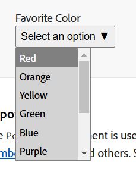
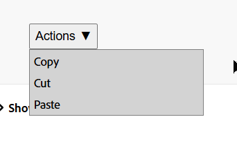

> [!warn]
> この記事は他サイトから移行したものです。

こんにちは、mehm8128 です。
サークルで投稿していた過去の記事はこちらからご覧ください。

https://trap.jp/author/mehm8128

今回はタイトルの通り Combobox のフォーカス折り返しについて気になって調査していたので、折角なのでブログにしてみることにしました。

## 調査背景

数日前からほぼ毎日 React Aria のドキュメントとソースコードを読んでいるのですが、[useSelect – React Aria](https://react-spectrum.adobe.com/react-aria/useSelect.html) を用いた実装例を眺めていたところ、あることに気づきました。
`useSelect`は以下の画像のような Select を実装することができるのですが、この Select で一番下のオプションにフォーカスしているときに、さらに ↓ キーを押しても一番上のオプションにフォーカスしないのです(逆に、一番上のオプションにフォーカスしているときに ↑ キーを押しても一番下のオプションにフォーカスしません)(以降この動作を「フォーカスが折り返される」と表現します)。

しないのが当たり前、と感じる人もいるかもしれませんが、僕は当たり前にするものだと思っていたので「あれ？」となりました。そして、React Aria の実装から調査を始め、React Aria のドキュメントにも情報源として書かれている、W3C の APG を見に行きました。その流れを書いていきます。

ちなみに、フォーカスが折り返される例はこちらの Gif です。デモへのリンクは後で書きます。

## React Aria

`useSelect`を用いた実装例では、今回見ているリストの部分は [useListBox – React Aria](https://react-spectrum.adobe.com/react-aria/useListBox.html) を用いて実装されています。この hooks 自体の実装例を見ても、フォーカスは折り返されていません。また、同様に`useListBox`を用いて作られている [useComboBox – React Aria](https://react-spectrum.adobe.com/react-aria/useComboBox.html) の実装例も同じような動作です(最近見ているのが components ではなくて hooks のドキュメント・ソースコードなので hooks 中心の説明になってしまい分かりづらくてすみません)。

しかし、似たような UI でも異なる動作をする hooks がありました。[useMenu – React Aria](https://react-spectrum.adobe.com/react-aria/useMenu.html) です。Select や Combobox はフォームに入力するオプションを選ぶ要素なのに対して、Menu はクリックすると何らかのアクションを起こしたいときに使うものです(と思っていたのですが今見てみたらそうでないときも使えそうで分からなくなってます)。
`useMenu`のページの実装例を見てみると、こちらはフォーカスが折り返されるようになっています。最初の Gif がこれです。

## ARIA Authoring Practices Guide

ARIA Authoring Practices Guide (APG) とは、W3C が公開している、Web サイトの実装者がアクセシブルな Web サイトを作るためのパターンを紹介しているサイトです。必要に応じて実装例や [Accessible Rich Internet Applications (WAI-ARIA)](https://w3c.github.io/aria/) へのリンクも掲載されています。
React Aria のドキュメントには必要に応じて APG へのリンクが提示されているので、今回はこちらを確認していきました。

まず`useSelect`では、内部で`useListBox`を使って Select を実装していることから、ドキュメントには情報源として [Listbox Pattern | APG | WAI | W3C](https://www.w3.org/WAI/ARIA/apg/patterns/listbox/) へのリンクが提示されています。
`Keyboard Interaction`のセクションの`Down Arrow`というところが今回関係あるものです。

> Moves focus to the next option. Optionally, in a single-select listbox, selection may also move with focus.

とあります。訳すとこうです。

> フォーカスを次のオプションに移動する。任意で、単体セレクトの Listbox であれば、フォーカスが移動するとともに選択も移動する。

今回知りたい「一番下のオプションにフォーカスしているときに ↓ キーを押したとき」というフォーカスの折り返しに関する動作の記載はありませんでした。残念。

次に、`useCombobox`のドキュメントに提示されている、[Combobox Pattern | APG | WAI | W3C](https://www.w3.org/WAI/ARIA/apg/patterns/combobox/) を見てみました。
`Listbox Popup Keyboard Interaction`のセクションです。`Combobox Keyboard Interaction`のセクションは、選択中のオプションが表示される部分にフォーカスが当たっているときのキーボード操作について書かれているので注意してください。
`Down Arrow`にはこう書かれています。

> Moves focus to and selects the next option. If focus is on the last option, either returns focus to the combobox or does nothing.

今回は目的のものが書いてありました。訳すとこんな感じです

> フォーカスを移動し、次のオプションを選択する。最後のオプションにフォーカスしていれば、フォーカスを Combobox に戻すか、何もしない。

「フォーカスを Combobox に戻す」というのは、選択中のオプションが表示される部分にフォーカスを移動するということです。TextField がついていて検索できるようなタイプの Combobox であれば、フォーカスして再度検索できるようにするということです。

つまり、Combobox ではフォーカスの折り返しはしないということです。何もしないくらいならフォーカスの折り返しをした方がいいのでは？と思ったのですが、とりあえず次に進みます。

最後は`useMenu`のドキュメントに提示されている [Menu and Menubar Pattern | APG | WAI | W3C](https://www.w3.org/WAI/ARIA/apg/patterns/menubar/) を見ました。

`Down Arrow`の、2 つ目の項目を見てみます。さてなんて書いてあるでしょう。

> When focus is in a menu, moves focus to the next item, optionally wrapping from the last to the first.

訳します。

> メニューにフォーカスがあるとき、フォーカスを次のアイテムに移し、任意で最後のアイテムから最初のアイテムに折り返す。

`wrapping`をなんて訳せばいいか分からなかったのですが(調べると「包む」って出るけどなんか違う感)、今回は「折り返す」で訳してきました。もっといい訳があれば教えていただきたいです。
つまり`useMenu`の実装例で確認できていた、フォーカスが折り返される動作を定義しています。
React Aria はかなり APG に忠実に作られているっぽいので、おそらくここに書いてあったというのが理由で`useMenu`の実装例では折り返すようにしたのでしょう。

ちなみに、`About This Pattern`セクションの Examples からリンク踏んでもらうと各パターンの実装例が確認でき、Menu だけフォーカスが折り返されることも確認できると思います。

ではなんで Menu だけフォーカスが折り返されるのか？考えてみたけど分かりませんでした。Menu は基本的にアクションボタンを置くのに使われているので、そうではない ListBox だと何か不都合があるのか？とか考えてたけどそんなこともなさそうでした。
そこで僕は APG のテキストが管理されている GitHub リポジトリの issue を見ることにしました(React Aria の issue は確か既に確認していて、特に関連していそうなものは見当たらなかった記憶があります。どのタイミングで見たか忘れてしまったので書きませんでした)。

## そしてついに

APG の issue は [Issues · w3c/aria-practices](https://github.com/w3c/aria-practices/issues?q=sort%3Aupdated-desc+is%3Aissue+is%3Aopen) で管理されています。
それっぽい issue を求めて「combobox focus」とかで検索をかけてみて眺めていたところ、以下の issue が見つかりました。

https://github.com/w3c/aria-practices/issues/3061

最初 2 人は僕が書いてきたことと大体同じで、「なんかおかしくない？」みたいなことを言っています。
追加で補足しておくと、僕もこの issue を見て知ったのですが、Combobox の実装例の 1 つである [Editable Combobox with Grid Popup Example | APG | WAI | W3C](https://www.w3.org/WAI/ARIA/apg/patterns/combobox/examples/grid-combo/) の`Down Arrow`の動作の説明で以下のように書かれています。

> If focus is in the last row, moves focus to the first row.

訳すと

> フォーカスが一番最後の行にあるときは、一番最初の行に移動する。

これは先ほど [Combobox Pattern | APG | WAI | W3C](https://www.w3.org/WAI/ARIA/apg/patterns/combobox/) に書かれていた内容と矛盾します。

一応再掲。

> Moves focus to and selects the next option. If focus is on the last option, either returns focus to the combobox or does nothing.

この issue の最後のコメントで、どこかで運営チームによって議論されたログが提示されています。一部抜粋します。

> Matt_King: I think it's mostly editorial, at least initially. Though we need to get aligned on what we want the pattern to say
> Matt_King: My gut reaction is that the pattern might be too prescriptive and that there should potentially be more flexibility in the pattern
> Matt_King: We'll come back to this one, probably in several weeks

なんか訳すの難しそうだったので直訳はしないのですが、「a11y 上は特にどっちでも問題なくて、ドキュメントの構成がよくなさそう」という結論になっていそうだと理解しました。

ちょうど 3 ヶ月前にこのログが投稿されていて、「数週間後に再度検討する」みたいなことも書かれているのですが特に進展はなさそうです。
優先度が P3 になっているので、優先度は低めに扱われているのだと思います。

## 結論

ということで、Combobox はフォーカスが折り返されなくて Menu は折り返されるようになっている理由について考えていたのですが、結論としては a11y 的にはどっちでもよさそうということになりました。
いつかドキュメントがいい感じになるといいですね。
APG はちゃんと読んだことがあまりなかったので、React Aria と一緒にもっと読んでいこうと思いました。
また、具体的な内部実装についてはアドベントカレンダーかなんかで書こうかなと思ってるので、そちらもよろしくお願いします。
