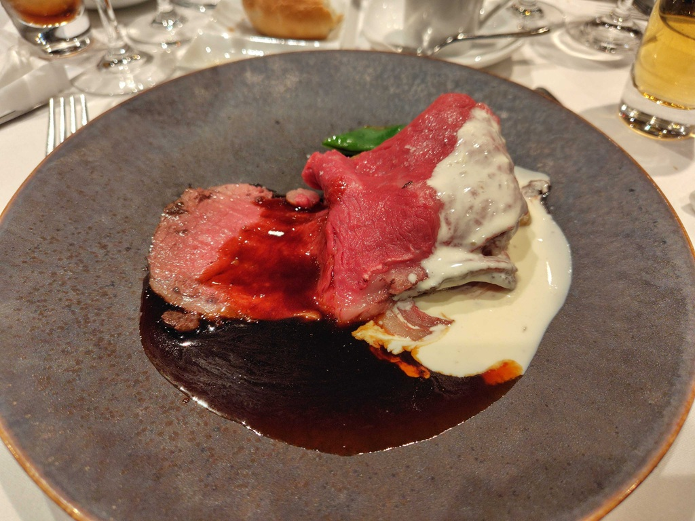

11/10～11/14に、TPAC 2025に参加してきました。本記事はそのレポートです。

TPACは簡単に言うと、W3Cのメンバーが1年に1回集まってミーティングする会議です。詳細は以下のサイトにあります。

https://www.w3.org/2025/11/TPAC/schedule.html

会員制なので、サイボウズとして参加してきました。

https://blog.cybozu.io/entry/joining-w3c

後でTPACの詳細とかまとめた記事がCybozu Inside Outから出ます。
→出ました

https://blog.cybozu.io/entry/2025/11/27/170000

https://blog.cybozu.io/entry/2025/11/28/113000

会場の入口付近の様子。

## 参加したミーティング

参加したミーティングは以下の通りです。複数ミーティングが同時進行で行われるので、ちゃんと見てたやつもあれば、時間の都合で少しだけ見ていたものもあります。

- 月曜
  - ARIA
- 火曜
  - ARIA
  - WHATWG
  - WCAG 2.2 and non-Latin languages (breakouts)
- 水曜 (breakouts)
  - Semantics for the Agentic Web
  - Dynamic Accessibility Remediation: A report from the Accessibility at the Edge Community Group
  - WCAG 3 update
  - Introducing an HTML `<amount>` Element
  - Accessibility Compat Data Update
- 木曜
  - WHATWG
  - WCAG Backlog Task Force
  - ARIA + APA
- 金曜
  - ARIA + AG
  - AG + APA
  - WHATWG + i18n + APA

特に印象的だったトピックを5つ挙げます。

## Accessibility Testing

- [minutes](https://www.w3.org/2025/11/10-aria-minutes.html#aa9f)

ARIAのミーティングで、ARIA-ATの話及び、Acacia、Accessibility Compat Data (ACD)の話がされました。特定のトピックについて議論というよりは、現状報告やそれに対する質疑応答がメインでした。

### ARIA-AT

そもそもARIA-ATとは、APGのサンプル実装が主要なブラウザと支援技術（AT）の組み合わせで相互運用性を持っていることを保証するために、自動・手動テストを作成・実施したり、その結果をAPGのページに[Assistive Technology Support Tables](https://www.w3.org/WAI/ARIA/apg/about/at-support-tables/)として掲載したりするプロジェクトです。これらはARIA WGではなく、[ARIA and Assistive Technologies Community Group](https://www.w3.org/groups/cg/aria-at/)が別で設けられて行われています。

https://aria-at.w3.org/

最初に、ARIA-ATの現状がスライドとデモで説明され、質疑応答が行われました。

- [スライド](https://docs.google.com/presentation/d/1vv3Ak2VlqQ-mlHdkQ_Uuotez6a6HZmkB0Tckc5UgAQI/edit?slide=id.p#slide=id.p)

プロセスの話だったり細かい内容が多く、あまりARIA-ATに詳しくない自分はついていけなかったのですが、Baselineの話は印象に残りました。ウェブプラットフォームの機能が主要なブラウザでサポートされてからの期間をWidely Availableなどの指標で示すのと同様に、主要なブラウザ・ATの組み合わせで読み上げなどが互換性を持つようになってからの期間もチャートなどの形で表示したいと考えているようです。

### Acacia

- [スライド](https://notes.igalia.com/p/ggryaQuLq#/)

ARIA-ATがAPGのサンプル実装に限ってe2e的に読み上げなどをテストするプロジェクトなのに対して、WPTはより広範囲を低レベルで単体テストするようなものになっています。例えばHTML要素のroleへのマッピングだったり、aria-labelでつけたものがちゃんとaccessible nameになっているかといったものです。しかし、これはまだroleとaccessible name (label) のみテストが可能で、他のプロパティはまだクロスブラウザでテスト可能ではありません。そのため、他のプロパティに対してもテストを可能にするためのRFCやPRが、WPTに対して出されているようです。それがAcaciaと呼ばれているプロジェクトです。これは、html-aamやcore-aamなどのテストになっています。

- [web-platform-tests/interop-accessibility: Accessibility Testing for WPT](https://github.com/web-platform-tests/interop-accessibility)
- [Tentative testdriver methods by jcsteh · Pull Request #226 · web-platform-tests/rfcs](https://github.com/web-platform-tests/rfcs/pull/226)
- [Explainer: WebDriver Extension for Accessible Nodes, etc. (potential solution for #197) · Issue #203 · WICG/aom](https://github.com/WICG/aom/issues/203)
- [Support for testing additional accessibility properties beyond name and role. by jcsteh · Pull Request #55784 · web-platform-tests/wpt](https://github.com/web-platform-tests/wpt/pull/55784)
- [Extend testdriver.js and wptrunner to test AAMs (platform accessibility APIs) by spectranaut · Pull Request #53733 · web-platform-tests/wpt](https://github.com/web-platform-tests/wpt/pull/53733)

少し前のものですが、Acaciaについての別の資料があります。

- [Acacia (for ARIA WG) - HedgeDoc](https://notes.igalia.com/p/u3q-Rq8Cw#/)
- [Acacia - HedgeDoc](https://notes.igalia.com/p/UCAZ3KYIo#/)

去年のTPACのminutes: https://www.w3.org/2024/09/27-webdriver-minutes.html#t02

既にLinuxでは動くようになっていて、今後MacとWindows対応を進めていくようです。

AAMテストがちゃんと書けるようになったら自分たちでも書けるようなものが出てくると思うので、もしかしたらWPTにコントリビューションできるチャンスになるかもしれません。

### Accessibility Compat Data (ACD)

最後に、Accessibility Compat Data (ACD)についての近況がスライドを用いて共有されました。
ACDはBrowser Compat Dataのアクセシビリティ版のようなもので、最近提案されて動き始めているものです。

https://github.com/lolaslab/accessibility-compat-data

https://lolaslab.co/blog/2025/accessibility-compat-data/

[a11ysupport.io](https://a11ysupport.io/)はARIA属性のみに限定されていたり、ARIA-ATはAPGのサンプルのみに限定されていたりと、十分なアクセシビリティの相互運用性データを提供していて、それをMDNなどの開発者向けプラットフォームに統合しているプロジェクトがないことから、始まったものです。

APA WGのメンバーには8月に概要を紹介する会が行われ、メールで録画も送られていました。そこでは、主に以下の3点が説明されていました。

- 以下の2点をチェックしてsupportedと定義すること
  - アクセシビリティツリーが意図したものになっていること
  - スクリーンリーダーの読み上げが意図したものになっていること
- スコープは以下の2点
  - Web featuresのa11yサポート状況データの収集
  - その収集したデータを、MDNやCan I useなど開発者向けプラットフォームに組み込む
- 以下の2点は一旦スコープ外
  - ブラウザ・AT間での差分がブラウザのバグなのか、意図的な挙動なのかの区別
  - ブラウザ・AT間での差分がブラウザの挙動によるものなのかATの挙動によるものなのかの区別

また、現在はスクリーンリーダーに絞られていますが、後にその他の支援技術もサポートされる予定とのことです。

AcaciaのAAMテストとの違いは、AAMはAAMなのでAccessibility APIへのマッピングの部分までですが、ACDは各支援技術での読み上げの違いもデータとして持ち、相互運用性を持つことを目指していることです。

水曜にACDについてのbreakoutsがあったので、こちらも見てきました。

- [スケジュール](https://www.w3.org/events/meetings/2d4dd8b1-76dc-4dba-8b1d-5986cb27b6dd/)
- [minutes](https://www.w3.org/2025/11/12-acd-minutes.html)

ここでは、WPTのテストケースを流用して一部のテストを書けそうということや、テスト自動化のために現在開発中の[AT Driver](https://w3c.github.io/at-driver/)を利用できそうなこと、これを用いてスクリーンリーダー以外の支援技術にも拡大していくことができそうなことなどが議論されていました。

非常に有益そうで興味のあるプロジェクトである一方で、既存のエコシステムをどう組み合わせてどの範囲を新しくテストするかなど、考えることがたくさんありそうな印象を受けました。引き続き動向を追っていきたいです。

## 新機能のアクセシビリティレビューのプロセス見直し

- [minutes](https://www.w3.org/2025/11/11-aria-minutes.html#23f4)
- [issue](https://github.com/w3c/aria/issues/2496)

今回のARIAミーティングでは、スケジュールにUpdate from Open UIがPart4まであることから分かるように、Open UI発祥の機能についてのアクセシビリティレビューの議論がたくさんありました。主にPopover API、Anchor Positioning、Invoker Commands、Interest Invokers、Menu Element、Customizable Comboboxなどです。
特に、Anchor Positioningについては途中で予定になかったWHATWGとのjoint meetingが発生することもありました。

各minutesはこちらのスケジュールからご覧ください。

https://github.com/w3c/aria/wiki/TPAC-2025-Kobe,-Japan-Agenda

一連のアクセシビリティレビューがあったものの、特にAnchor Positioningや最近提案されている`interactivity: focusable`などの新しいCSSの機能でアクセシビリティの観点でのレビュープロセスが明確でなく、十分に検討されずにshipされてしまうこともあったことへの懸念から、プロセスの見直しが行われました。

結果、2021年までCSS Accessibility Task Forceによって管理されていて現在は止まっている[CSS-AAM](https://github.com/w3c/css-aam/)を実験的に再始動させることになり、早速再始動PRも出されています。

https://github.com/w3c/aria/pull/2673

CSS-AAMを再始動させることで、CSSのAccessibility APIへのマッピングを議論する仕組みが設けられるようになり、早いタイミングでのレビューが可能になったり、十分に議論されていない機能がshipされてしまうことを防ぐことができるようになると期待できます。

## Dynamic Accessibility Remediation: A report from the Accessibility at the Edge Community Group

- [スケジュール](https://www.w3.org/events/meetings/c986882c-0da9-48d9-8eab-6313cde178ea/)
- [minutes](https://www.w3.org/2025/11/12-a11yedge-minutes.html)
- [レポート](https://www.w3.org/community/reports/a11yedge/CG-FINAL-a11yedge-capabilities-20251104/)

「Accessibility Capabilities: Post-Source Code and Content」という、アクセシビリティオーバーレイのように既存のサイトに対して後からアクセシビリティ対応をする場合のメリットやトレードオフを調査してまとめたレポートについての紹介＋質疑応答のbreakoutsでした。

理想的な世界ではそれぞれのWebサイトでWCAG準拠のアクセシビリティ対応ができているのが一番ですが、現実的にはそうもいかないので、ポストソース（≒後からソースコードに追加するもの）での対応がどうしても必要になってくるとのことでした。

内容を詳しく知っている人があまりいないミーティングだったらしく、質疑応答はあまり盛り上がっていませんでしたが、UAAGやATAGがメンテされていないので、そちらも確認して参考にするべきという話や、端末間でフォントサイズやフォントカラーなどのポストソースの設定を共有・同期する方法がOSレベルでほしいという話がされていました。

アクセシビリティオーバーレイとの違いがまだあんまり分かっていないのですが、UIウィジェットは提供せずに修正することが想定されていたり、W3Cの活動であることから当然プライバシーは保護されていることを前提としていたり、既存のアクセシビリティオーバーレイの問題は一通り考慮した上で検討されているような雰囲気を感じました。
もう少し中身を読みつつ、今後注視していきたいです。

参考：アクセシビリティオーバーレイの問題点が掲げられている署名サイト

https://overlayfactsheet.com/ja/

## WCAG 3 update

- [スケジュール](https://www.w3.org/events/meetings/140f2455-7351-4ea9-a71d-023ad26dccfc/)
- [minutes](https://www.w3.org/2025/11/12-wcag-update-minutes.html)
- [スライド](https://www.w3.org/2025/Talks/TPAC/wcag3-update/)
- [explainer](https://www.w3.org/TR/wcag-3.0-explainer/)
- [WCAG 3](https://www.w3.org/TR/wcag-3.0/)

WCAG 3の現状と今後についてのbreakoutsでした。
スライドではWCAGのそれぞれのコンテンツの成熟度を表すMaturityという概念があることや、全体の構造、適合性の話、アクセシビリティサポーテッドの話、今後のスケジュールなどが紹介されました。

構造については6枚目のスライドにあるように、WCAG2でいう達成基準に当たるFoundational and supplemental requirementsに、WCAG2のUnderstandingやTechniquesに当たるinformativeな情報が付随しているようです。それに加え、一貫して繰り返し可能なテストを行うことが難しい達成基準のためのAssertionsが存在しています。11ページ目のスライドにあるように、具体的な指標ではなく「ちゃんと確認した」と主張するための抽象的なチェックリストのようなものを設けているという認識です。これは特に[COGA](https://www.w3.org/WAI/about/groups/task-forces/coga/)など別のTask Forceでの作業の結果、生まれた概念とのことです。

アクセシビリティサポーテッドは、達成基準の達成方法として記載されているテクニックが、実際にブラウザ・支援技術などの組み合わせで機能するかどうかというものです。[WAIC](https://waic.jp/)の作業部会2ではこの情報をデータベースとしてまとめる作業が行われています（[参考：アクセシビリティ サポーテッド（AS）情報 | ウェブアクセシビリティ基盤委員会（WAIC）](https://waic.jp/guideline/as/)）。そのようなデータベースを今までW3Cでは持っていなかったのですが、WCAG3では"Accessibility support set"として達成基準を満たすことができるブラウザや支援技術の組み合わせのデータベースを作っていくようです。

質疑応答では、COGAなどのTask Forceの話やタスクベースのアクセシビリティ基準がほしいという話、コントラストアルゴリズムの話などが質問されていました。

個人的には、COGAなどのTask Forceは全然追えてなくてガイドラインも読めていなかったのですが、知見がWCAG3に反映されるような体制があることが分かったのがよかったです。

## WCAG CJK

WCAG 2.2 and non-Latin languagesというbreakoutsで、日本人の方が「WCAG 2.2って欧米中心で、CJK言語が適切に扱われていないよね」という提案としていたのを皮切りに、他のいくつかのWGのミーティングでもCJKの話が話題に上がっていたのが今回のTPACで最も印象的でした。

### WCAG 2.2 and non-Latin languages (breakouts)

- [提案](https://github.com/w3c/tpac2025-breakouts/issues/38#issuecomment-3506486553)
- [別のissue](https://github.com/w3c/wcag/issues/4263)
- [minutes](https://www.w3.org/2025/11/10-wcag2-non-latin-minutes.html)
- [chairスライド](https://www.w3.org/2025/Talks/TPAC/wcag-non-latin/)
- [村田さんスライド](https://www.asahi-net.or.jp/~eb2m-mrt/Proposed_changes_to_WCAG_2.pdf)

提案した村田さんの記事です。

https://note.com/don_quijote/n/n9e6a977a4d0e

提案は大きく分けて、chairの方のスライドと村田さんのスライドの2つがあります。
1つは、村田さんのスライドのルビの話。HTMLだと`<ruby>`要素によって本文とルビが紐づけられるけど、PDFでは紐づけることなく小さい文字で隣の行に表記されることが発生してしまうことから、「本文とルビの関係はprogrammatically determinableであるべき」という達成基準をレベルAで追加することが提案されています。
もう1つは、テキスト間隔や1行あたりの文字数の基準となる数値を表記体系によって再定義する提案です。現状テキスト間隔は言語に依らず定義されており、1行あたりの文字数についてはCJKとそれ以外でざっくり定義されていたり、どちらも「例外」として注釈がつけられていたりします。これを、言語依存に関する説明をするセクションを設け、それに基づいて既存の達成基準を見直すことが提案されました。

スライドの発表後の質疑応答では、i18n WGのメンバーから既に議論したことのある内容についての説明がされていました。その後、主にルビの提案の話についてユースケースの共有などが行われました。

このbreakoutsでは情報共有程度で具体的に何かnext actionが決まることはなかったものの、次のセクションで紹介するミーティングで動きが見られました。

### WCAG Backlog Task Force

水曜の夜のevening reception（懇親会的なやつ）でW3Cスタッフの日本人の方にWCAGのi18nについて話を聞かせていただき、木曜にWCAGのミーティングがあったら参加してみようと思い確認したところ、WCAG Backlog Task Forceのミーティングがあったので参加してみました。

このTask Forceの存在を知らなかったのですが、元々は特にUnderstandingとTechniquesのメンテナンスに注力しているようです（[参考：2025年のWebアクセシビリティ | gihyo.jp](https://gihyo.jp/article/2025/01/web-accessibility-prospect#gh7qdcQIUo)）。

なのでWCAGのi18nじゃなくても、WCAGの雰囲気が掴めたらいいな、くらいの気持ちで見に行ったのですが、今回はたまたま先ほどのWCAGのi18nの話がメインで行われました。

スライド: https://docs.google.com/presentation/d/1x8JncN-V_a5HRxGIl6neVta9eYBskrVKOJjyKV6j1mU/edit?slide=id.g3a1d2fc24ff_1_5#slide=id.g3a1d2fc24ff_1_5
minutes: https://www.w3.org/2025/11/13-wcag2-backlog-minutes.html

最初に、ルビの提案について以下の2つが話し合われました。

- 新しく達成基準を作るのか、informativeなもの（techniqueなど）を増やすのか
  - 既存の1.3.1/1.3.2でカバーできないのか
- （作るか分からない）WCAG2.3で入れるのか、WCAG3で入れるのか

達成基準1.3.1/1.3.2も関係はあるが、より明確にするために別で定義したいという主張がされていましたが、結果failure techniqueを追加する方針になりました。

https://github.com/w3c/wcag/issues/4746

次に、テキスト間隔の提案について、どのように値を参照させるかという議論がありました。
理想的には使用する言語ごとに基準となる値を参照できるようなメカニズムがほしいという話から、外部レジストリを利用するという話になりました。
ただ、外部レジストリはメンテナンスがなかなか行われず、W3Cでは厳格な管理プロセスが決められていることもあり、実際に利用するのは難しそうとのことです（[レジストリについて](https://www.w3.org/standards/types/#x3-w3c-registry-track)）。

また、実際に値を入力する人がいないという問題も挙げられていたので、日本語ではこういう研究があってこういう値にするのが良さそう、という提案を日本人である自分たちができるといいかもしれません。
今後はレジストリについてもう少し調査が進むようです。

### Pronunciation ・AAC Symbols

- [ARIA+APA minutes](https://www.w3.org/2025/11/13-aria-minutes.html)
- [use cases](https://w3c.github.io/pronunciation/user-scenarios/)
- [explainer](https://w3c.github.io/pronunciation/explainer/)
- [WHATWG + i18n + APA minutes](https://www.w3.org/2025/11/14-apa-minutes.html)
- [AAC Symbols](https://www.w3.org/TR/aac-registry/)

教育用の教材や電子書籍のルビなどで、テキスト読み上げ用の音声コンテンツが埋め込まれることがあります。また、認知障害・学習障害などの人たちのためにも、文章に対して音声情報を付与することは意味があります。そこでSSMLや[CSS Speech](https://www.w3.org/TR/css-speech-1/)などが検討されて、実際に利用される場面もありましたが、あまり上手くいかなかったので、仕切り直しを検討しているとのことです。

ARIA+APAのjoint meetingではアクセシビリティ上の懸念点について議論がありましたが、とにかくユースケースが不足しているので、ユースケースを集めたいということになりました。

また、WHATWG + i18n + APAのjoint meetingではAPG + AGのjoint meetingでも少し話されていた、AAC Symbolsというものについて議論がありました。AAC Symbolsとは、自然言語の代替として記号で表すことで、認知障害・言語障害のあるユーザーなどでも効率的に文章を理解できるようにするというものです。
これが現在、ルビとして文字の上に記載されることが検討されています。さらに別の話として、ルビにも複数の用途があることから、`<ruby>`要素では`type`属性の追加が検討されています。

https://github.com/w3c/html-ruby/issues/24

その上で、今回のAAC Symbolsをルビとして表示する場合には、新しく`type="symbolic"`というものを追加し、役割を明確にしたいという議論が行われました。しかし、そもそもAAC Symbolsをルビとして扱う方針で適切なのかどうかという話や、見える人が読むための記号なのでスクリーンリーダーで読み取ることができる必要があるのかどうかという話、どちらかというと手話に近いものなので本文と1対1で対応させることができないのではないかという話などが議論されていました。

結果、次のステップとしてexplainerを作成することになりました。

`<ruby>`要素の`type`属性はどうやら[数年前から村田さんが提案していた](https://github.com/w3c/aria/issues/1620)ようで、issueを見てもらえば分かるように、日本語でのルビの用例が複数パターン記載されています。

ルビは日本語特有のものだと思っていましたが、AAC Symbolsという形でルビに少し似たような役割をするものが提案されていることが分かったり、Pronunciationの議論でもユースケースが足りないとのことだったので、ルビに慣れている日本人として色々と情報提供ができそうと感じました。

### WCAG CJKまとめ

今年6月の欧州アクセシビリティ法の施行のように国レベルでWCAGをアクセシビリティの基準にしていたり、日本だと法律まではいかなくともWCAGがJIS規格になって各企業でJIS規格に沿った試験が行われ、それが企業ホームページにアクセシビリティ方針として掲載されていたりと、WCAGがアクセシビリティの基準になることが多いです。ただ、その基準が本当に妥当なものなのかというのを気にしている人は多くないし、気にしている人でも実際にW3C側に改善の提案する人はほとんどいないと思います。
しかし、WCAGの策定には欧米の人たちが多く関わり、日本人はあまり関わっていないことから、今回のように日本語の場合の基準が十分に議論されていなかったり、例外扱いされてしまっているケースがあることが分かりました。今回の2点に限らず、今後このような言語依存の達成基準によって本当は十分に基準を満たしているはずのWebサイト・サービスでもWCAGの基準に従うと未達成という判定にせざるを得ないケースが発生する可能性があります。
そこで日頃からWCAGの動向を注視し、今回のように日本語が十分に考慮されていないものを見つけたら自分たちで改善の提案をしていったり、日本語に関する問題に限らず様々なフィードバックをしていきたいし、そういうことができるということをWebアクセシビリティに関わる全ての人に知ってもらいたいです。

## その他

月曜日の夜は日本会員ディナーでした。同じテーブルになった、デジタル庁の方のお話を聞かせていただきました。

また、火曜日のお昼にGoogleのChromiumチームの方々と一緒に鉄板焼きを食べさせていただきました。普段聞かないような話が聞けて貴重な機会だったし、自分が取りまとめを行ってる[Web標準動向](https://zenn.dev/cybozu_frontend/articles/web_standards_monthly_202509)を見たとのことで声をかけて下さったので、やっていてよかったです。

## 全体を通しての感想

箇条書きですが全体を通しての感想です。

- 普段見ているminutesよりも遥かに多くの議論が交わされ、テキストで見ているのはほんの一部の発言だということが分かった
- 今までGitHubのissueなどを人ベースで追うことができていなかったけど、実際に会場に行って人の顔と名前をセットで覚えられて、今後は人ベースで追えるようになったのが大きいと感じた
  - 「誰か知らない人たちが議論してる」よりも、「あそこでああいうことを言っていた人がここではこういうこと言ってる」みたいに認識できた方が内容の理解も深まるし、議論の流れも追いやすくなりそう
- breakoutsは「いつものメンバー」って感じの集まりじゃないし、前提知識があんまり必要とされないものもあるので、WGのミーティングと比べて質問とかしやすそうな雰囲気だった
  - 「今こういうのが進んでるんだけど何か意見とか質問とかある？」的な
- 少人数で標準化が行われていることを体感した
  - ARIAのミーティングはi18nとかよりは多いものの、日本人でgroup participantとして参加していたのは自分1人＋observerとして途中から参加していた人が1～2人程度だった
- 反省点として、日本人含めてネットワーキングはあまりできなかった
  - 上でもちょっと書いたように、WGメンバーはそもそもほとんど知らなかったのでしかたないところはある

## まとめ

頑張ってZOOMの文字起こしを追ったり、後からminutes読んでまとめたりしましたが、やっぱり英語を直接聴き取れた方が理解できるので英語のリスニング頑張らないとなと思いました。
来年はアイルランド開催なので現地に行けるかは分からないですが、オンライン参加はできると思うので、来年までに知識を増やしたり得たいものを明確にしたりリスニング力上げたりしてちゃんと準備しておこうと思います。
