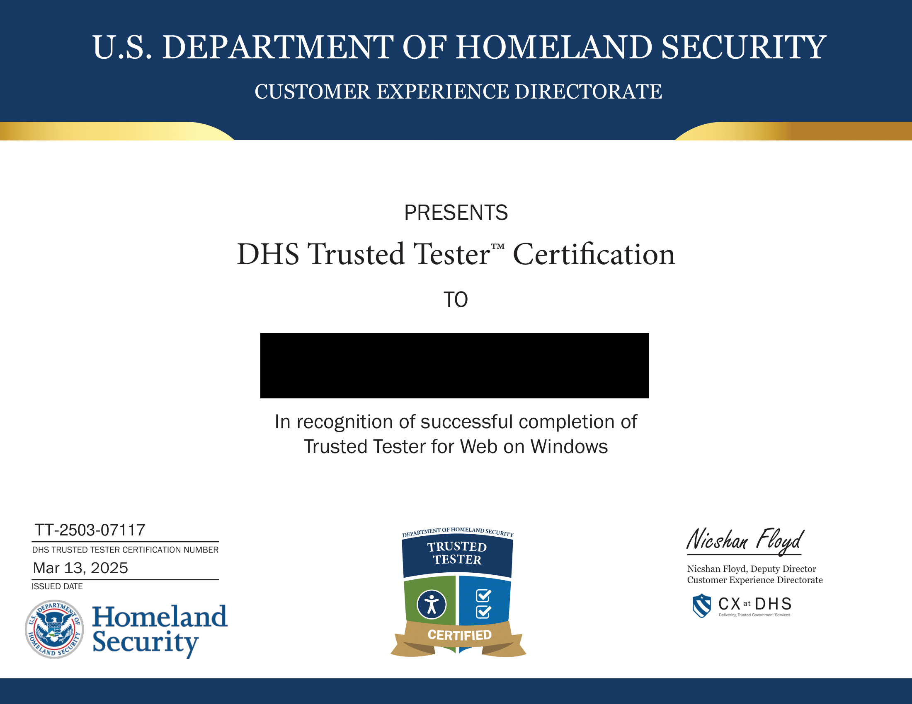

> [!warn]
> この記事は他サイトから移行したものです。

こんにちは、フロントエンドが好きな無職の mehm8128 です。
今回は、3 月前半に DHS Trusted Tester Certification という資格を取得したので、体験記を書きます。

## DHS Trusted Tester Certification とは

以下の記事が参考になります。僕はこの記事の元になった「アクセシビリティ大忘年会」の発表を聞いて、興味を持ちました。
簡単に言うと、Section 508 というアメリカの法律に基づくアクセシビリティ試験をちゃんとできるということを証明する、DHS（アメリカ合衆国国土安全保障省）が提供している資格です。

https://qiita.com/mu_tomoya/items/73c4f8a89a27b601eb34

また、アクセシビリティ界で有名な、高須さんも取得しているようです。

https://www.wantedly.com/companies/skword/post_articles/538383

## 動機

Trusted Tester Certification の存在自体は上述のように、アクセシビリティのイベントで知りました。
さらに、Web アクセシビリティについて本で読んだり普段の開発で意識する必要がある程度の知識はあるのですが、知識のある領域が偏っていたので（例えば動画を扱うようなサービスに関わったことがなかったりなど）もっと網羅的な知識をつけたいという気持ちがあり、取得することにしました。
また、普段から「Web アクセシビリティに興味がある」とは言っているものの、では実際にどのくらい業務で役に立てるかという指標を持っていなかったというのもありました。単純な技術力などだと、ある程度成果物や業務経験などで証明できるし、例えばパフォーマンス改善の知識・能力ならパフォーマンス改善系の大会実績などで証明できたりもしますが、アクセシビリティという分野だとなかなかそういった証明方法がないので、このような資格を持っているということが 1 つの証明方法となるのではないかと考えました。
AI がコーディングする時代においても品質保証は最終的に人間がやることになると思うので、試験実施ができるようになったのは大きな強みだと思います。

## 内容について

上記の記事でも説明がありますが、念の為。本資格の試験内容の多くは WCAG 2.0 に沿っていて、レベル A と AA を対象としていますが、全てではなくて一部のみ、さらに支援技術を使わずに行うことができる方法でのみ試験をすることになっています。
おそらく以下のリンクにある PDF が、最新の試験ガイドラインです。
[Trusted Tester Test Process v5.1.3.pdf](https://github.com/Section508Coordinators/TrustedTester5.1/blob/main/Documents/Trusted%20Tester%20Test%20Process%20v5.1.3.pdf)

WCAG 2.0 の達成基準は、パッと見 AAA 以外のものは一通り網羅されているように見えました。
ただ、支援技術を使わない試験ということもあって、試験方法については十分とは言えなさそうなものもあったので、WCAG に即した試験をしたい場合は注意が必要だと思います。

WCAG 2.2 と比較すると、主に以下の達成基準に対応するものがなかったので、今後 2.2 に沿って改定されるかもしれません。

- [達成基準 1.4.10 リフロー](https://waic.jp/translations/WCAG22/#reflow)
- [達成基準 1.4.12 テキストの間隔](https://waic.jp/translations/WCAG22/#text-spacing)
- [達成基準 2.5.8 ターゲットのサイズ (最低限)](https://waic.jp/translations/WCAG22/#target-size-minimum)

## 勉強と資格取得の流れ

学習コースが提供されているので、以下のサイトで学習コースをどんどん進めていけば OK です。
逆に、学習コース及びそれに付随する小テストや模擬試験をクリアしなければ、本試験を受けることができません。

https://training.section508testing.net/

学習コースは主に 6 つのコンテンツに分かれています。

- Section 508 What is it and Why it is Important
  - Section 508 についての説明です
- Section 508 Standards for Web
  - 本資格の範囲に含まれている達成基準について、1 つ 1 つ例を挙げて紹介されています
  - かなり分量が多いです
- Trusted Tester Testing Tools
  - 本資格の試験で使う 2 つのツールについての紹介です
- Trusted Tester Training for Web
  - 実際の試験方法が、各トピックについて説明されています
  - めっちゃ分量が多いです
- Trusted Tester for Web Practice Exam
  - 模擬試験です。100 問中 85% 取れれば合格です
- Trusted Tester for Web Certification Exam
  - 本試験です。模擬試験同様、100 問中 85% 取れれば合格です

詳細は以下の記事が参考になります。
https://sititou70.github.io/%E3%80%90Web-a11y%E3%80%91DHS-Trusted-Tester-Certification%E5%8F%97%E9%A8%93%E8%A8%98/

全部英語なので、学習コースのページを画面右半分に配置して、左半分に置いた Google 翻訳にコピペしながら読んでいました。

僕は模擬試験の 1 回目が 83 点で不合格、2 回目が 92 点で合格、本試験が 1 回目に 91 点で合格でした。

## まとめ

とにかく量が多かったのと、全部英語だったのでしんどかったですが、時間のあるときに取得できてよかったです。3 月に入ってすぐに勉強を始めて、3/13 に合格したので、半月ほどで合格できました。
今回は特にレベル AAA のものに触れていないので、レベル AAA については WCAG を読んでちゃんと知識をつけておきたいです。
